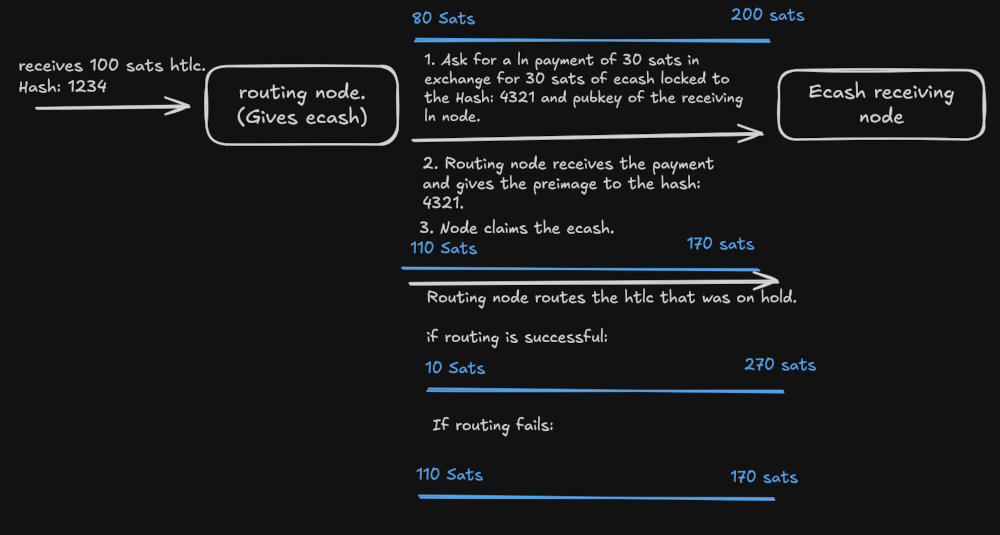

# ecash JIT Lightning Channel Rebalancer

**_Do not use this nowhere near mainnet as you will more than likely lose money._**

Experimental project to rebalance a lightning channel for routing payments using ecash.

This is a cashu wallet that runs along LND and it uses [LND's HTLC Interceptor](https://docs.lightning.engineering/lightning-network-tools/lnd/htlc-interceptor). It will intercept incoming HTLCs and if the node does not have enough liquidity to route the payment, it will try to rebalance the channel with its peer by doing a swap between a Lightning HTLC and a Cashu HTLC.

## Flow 

Thanks to [lescuer97](https://github.com/lescuer97) for the help with the idea.
